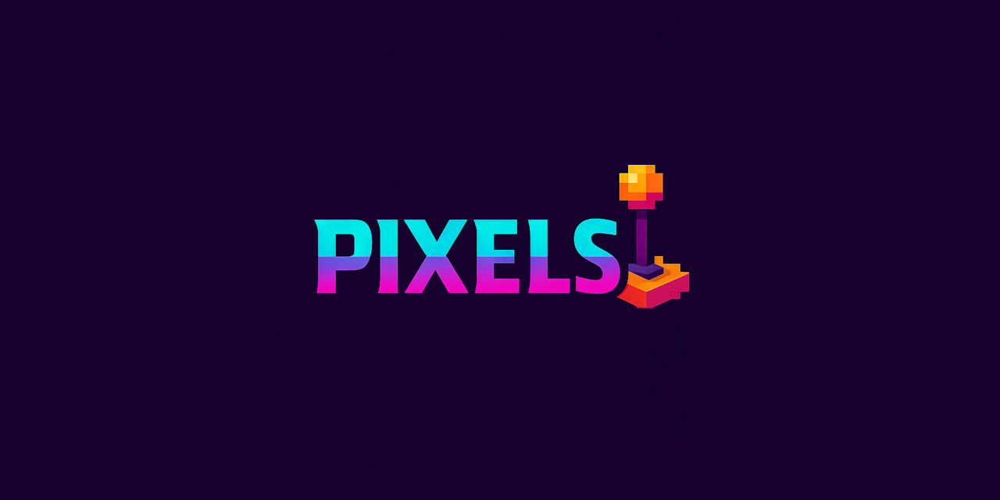

  
[](https://discord.gg/tPWjMwK)
[](https://bsky.app/profile/tinybiggames.com)    

**PIXELS** is a comprehensive and high-performance 2D game development framework engineered specifically for Delphi developers who demand professional results. Built on the rock-solid foundation of the industry-proven [Allegro Library](https://github.com/liballeg/allegro5), PIXELS delivers enterprise-grade game development capabilities with the elegance and productivity that Delphi developers expect.

Whether you're building classic arcade games, stylish pixel art adventures, or rich interactive applications, PIXELS gives you the foundation you need — fast graphics, smooth input handling, audio playback, asset management, and more — all fully native to Delphi.

### Why PIXELS?
- **Native Delphi Integration** — Seamlessly integrates with your existing Delphi workflow, leveraging familiar Object Pascal syntax and modern language features
- **Production-Ready Performance** — Hardware-accelerated graphics, optimized rendering pipeline, and efficient memory management for smooth 60+ FPS gameplay
- **Complete Game Development Stack** — Everything you need in one cohesive package: advanced graphics rendering, multi-format audio playback, precise input handling, flexible asset management, and powerful animation systems
- **Developer-Friendly APIs** — Clean, intuitive interfaces designed by developers, for developers — spend time creating, not debugging

### Perfect For:
- Classic arcade and retro-style games with pixel-perfect precision
- Modern indie games with stunning visual effects and smooth animations  
- Interactive educational applications and multimedia presentations
- Rapid prototyping and game jams where time-to-market matters
- Commercial game projects requiring robust, maintainable codebases

Transform your game ideas into polished, professional experiences with PIXELS — where Delphi's power meets modern game development excellence.

## ✨ Features

### 🎮 Core Game Framework
- **Fully Delphi-Native**: Designed for Delphi developers, by Delphi developers
- **Game Loop Architecture**: Built-in deterministic game loop with configurable frame rates (60 FPS default)
- **Object-Oriented Design**: Clean inheritance model with `TpxGame` base class
- **Resource Management**: Automatic tracking and cleanup of game resources

### 🖼️ Graphics & Rendering
- **Hardware-Accelerated 2D**: Fast OpenGL-based rendering pipeline
- **Texture Management**: Support for PNG, JPEG, and other common formats
- **Sprite System**: Advanced sprite class with animation, scaling, rotation, and collision
- **Texture Atlas**: Efficient sprite sheet management with animation sequences
- **Shader Support**: Custom GLSL shader support for visual effects
- **Camera System**: 2D camera with zoom, rotation, shake effects, and smooth following
- **Blend Modes**: Multiple blending modes for advanced visual effects
- **DPI Scaling**: Automatic high-DPI display support

### 🎵 Audio System
- **Music Playback**: Streaming audio for background music (OGG)
- **Sound Effects**: Low-latency sample playback with multiple channels (OGG)

### 🕹️ Input Handling
- **Keyboard Input**: Full keyboard support with key states and event handling
- **Mouse Support**: Mouse movement, buttons, and wheel with logical coordinate mapping
- **Joystick/Gamepad**: Complete controller support

### 🧮 Mathematics & Utilities
- **Vector Math**: 2D/3D vector operations, transformations, and utilities
- **Collision Detection**: AABB, OBB, circle, and pixel-perfect collision methods
- **Easing Functions**: Comprehensive easing library for smooth animations
- **Random Utilities**: Enhanced random number generation with seeding
- **Angle Operations**: Optimized trigonometric functions with lookup tables

### 📁 Asset Management
- **File I/O**: Flexible file system supporting disk, memory, and ZIP archives
- **ZIP Support**: Password-protected archive loading for asset distribution
- **Font Rendering**: TrueType font support with multiple sizes and colors
- **Texture Loading**: Efficient texture loading with color key support

### 🎯 Advanced Features
- **Console Integration**: Rich console output with colors and formatting
- **Video Playback**: Full-screen video support for cutscenes
- **Network Ready**: Foundation for future networking capabilities
- **Cross-Platform Ready**: Windows out of the box; groundwork for future expansion

> 🚧 **This repository is currently under construction.**
>  
> PIXELS is actively being developed. Features, APIs, and internal structure are subject to change.  
>  
> Contributions, feedback, and issue reports are welcome as the project evolves.

## 🚀 Quick Start

### System Requirements
- **Delphi**: Any version supporting Win64/Unicode
- **Platform**: Windows 10/11 (x64)
- **Graphics**: OpenGL 3.0 compatible GPU
- **Tested**: Windows 11 (24H2) and Delphi 12.3 (latest patches)

### Installation

1. **Clone the repository:**
   ```bash
   git clone https://github.com/tinyBigGAMES/PIXELS.git
   ```

2. **Add to your project:**
   - Add the `src` folder to your Delphi library path
   - Include `PIXELS.*` units in your uses clause

3. **Create your first game:**

```pascal
program MyFirstGame;

{$APPTYPE CONSOLE}

uses
  PIXELS.Game,
  PIXELS.Graphics,
  PIXELS.Events;

type
  { TMyGame }
  TMyGame = class(TpxGame)
  private
    FFont: TpxFont;
  public
    function  OnStartup(): Boolean; override;
    procedure OnShutdown(); override;
    procedure OnUpdate(); override;
    procedure OnRender(); override;
  end;

{ TMyGame }
function TMyGame.OnStartup(): Boolean;
begin
  Result := False;
  
  // Initialize window
  if not TpxWindow.Init('My First PIXELS Game', 800, 600) then Exit;
  
  // Load default font
  FFont := TpxFont.Create();
  FFont.LoadDefault(12);
  
  Result := True;
end;

procedure TMyGame.OnShutdown();
begin
  FFont.Free();
  TpxWindow.Close();
end;

procedure TMyGame.OnUpdate();
begin
  // Quit on pressing ESC
  if TpxInput.KeyPressed(pxKEY_ESCAPE) then
    SetTerminate(True);
    
  // Toggle fullscreen on pressing F11  
  if TpxInput.KeyPressed(pxKEY_F11) then
    TpxWindow.ToggleFullscreen();
end;

procedure TMyGame.OnRender();
begin
  // Clear screen
  TpxWindow.Clear(pxBLACK);
  
  // Draw text
  FFont.DrawText(pxWHITE, 10, 10, pxAlignLeft, 'Hello PIXELS!', []);
  
  // Draw a rectangle
  TpxWindow.DrawFillRectangle(100, 100, 200, 150, pxRED);
end;

begin
  // Run the game
  pxRunGame(TMyGame);
end.
```

## 📚 Core Components

### Game Structure
- **`TpxGame`**: Base class for all games with event-driven architecture
- **`pxRunGame()`**: Main entry point that handles the complete game lifecycle

### Graphics System
- **`TpxWindow`**: Window management, rendering context, and display operations
- **`TpxTexture`**: Texture loading, manipulation, and rendering
- **`TpxFont`**: Text rendering with multiple alignment and formatting options
- **`TpxShader`**: Custom shader support for advanced visual effects
- **`TpxCamera`**: 2D camera system with smooth movement and effects

### Sprite System
- **`TpxSprite`**: Complete sprite implementation with physics and animation
- **`TpxTextureAtlas`**: Efficient sprite sheet management
- **Animation Support**: Frame-based animation with multiple playback modes

### Input & Audio
- **`TpxInput`**: Unified input handling for all device types
- **`TpxAudio`**: Music and sound effect playback system

### Mathematics
- **`TpxMath`**: Comprehensive math library with game-specific functions
- **`TpxVector`**: 2D/3D vector operations and utilities
- **Collision Detection**: Multiple collision methods for different use cases

## 📖 Examples

The `examples` directory contains sample projects demonstrating various PIXELS features:

- **Basic Rendering**: Simple shapes, textures, and text
- **Sprite Animation**: Character animation and movement
- **Input Handling**: Keyboard, mouse, and joystick examples
- **Audio Playback**: Music and sound effect integration
- **Collision Detection**: Different collision methods comparison
- **Camera Effects**: Camera movement, zoom, and shake effects

## 📺 Media
#### Videos📹  
[](https://www.youtube.com/watch?v=vBlyYL0x2oQ)  
<small>*click image to [open video](https://www.youtube.com/watch?v=vBlyYL0x2oQ)*</small>


## 🛠️ Support and Resources

- 🐞 **Report Issues** via the [Issue Tracker](https://github.com/tinyBigGAMES/PIXELS/issues)
- 💬 **Join Discussions** on the [Forum](https://github.com/tinyBigGAMES/PIXELS/discussions) and [Discord](https://discord.gg/tPWjMwK)
- 📚 **Learn More** at [Learn Delphi](https://learndelphi.org)
- 📖 **Read Documentation** in the [Wiki](https://github.com/tinyBigGAMES/PIXELS/wiki)

## 🤝 Contributing  

Contributions to **PIXELS** are highly encouraged! 🌟  

### How to Contribute
- 🐛 **Report Issues**: Submit issues if you encounter bugs or need help
- 💡 **Suggest Features**: Share your ideas to make PIXELS even better
- 🔧 **Create Pull Requests**: Help expand the capabilities and robustness of the library
- 📝 **Improve Documentation**: Help make PIXELS more accessible to developers
- 🎮 **Share Examples**: Contribute sample projects and tutorials

### Development Guidelines
- Follow Delphi coding conventions
- Include unit tests for new features
- Update documentation for API changes
- Test on multiple Windows versions

Your contributions make a difference! 🙌

#### Contributors 👥
<br/>

<a href="https://github.com/tinyBigGAMES/PIXELS/graphs/contributors">
  
</a>

## 🙏 Acknowledgments

**PIXELS** stands on the shoulders of giants:

- **[Allegro Library](https://github.com/liballeg/allegro5)**: The robust foundation that powers PIXELS
- **Delphi Community**: For decades of innovation in rapid application development
- **Contributors**: Everyone who helps make PIXELS better

## 📜 License

**PIXELS** is distributed under the **BSD-3-Clause License**, allowing for redistribution and use in both source and binary forms, with or without modification, under specific conditions.  
See the [LICENSE](https://github.com/tinyBigGAMES/PIXELS?tab=BSD-3-Clause-1-ov-file#BSD-3-Clause-1-ov-file) file for more details.

---

🎮 **PIXELS** — Professional 2D gaming, powered by Delphi. 🚀

<p align="center">

</p>
<h5 align="center">
  
Made with ❤️ in Delphi  
</h5>
