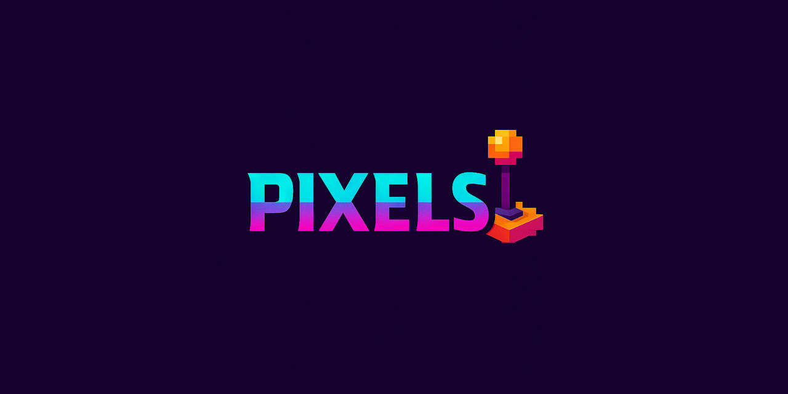

  

    

**PIXELS** is a lightweight and powerful 2D game development framework designed specifically for Delphi developers. Built on top of the proven and battle-tested [Allegro Library](https://github.com/liballeg/allegro5), PIXELS brings modern game development capabilities into the Delphi ecosystem with clean, easy-to-use APIs and high performance.

Whether you're building classic arcade games, stylish pixel art adventures, or rich interactive applications, PIXELS gives you the foundation you need — fast graphics, smooth input handling, audio playback, asset management, and more — all fully native to Delphi.

## ✨ Features

- **Fully Delphi-native**: Designed for Delphi developers, by Delphi developers.
- **Powered by Allegro**: Leverages the robust Allegro library for graphics, audio, input, window management and more.
- **Simple, Clean API**: Easy-to-understand object-oriented design that feels natural in Delphi.
- **Cross-Platform Ready**: Windows out of the box; groundwork in place for future cross-platform expansion.
- **Fast 2D Rendering**: Hardware-accelerated graphics for smooth frame rates.
- **Asset Management**: Built-in support for textures, fonts, sounds, and more.
- **Input Handling**: Keyboard, mouse, and joystick input made easy.
- **Sound and Music**: Play sound effects and background music with minimal effort.
- **Flexible Architecture**: Suitable for simple games, prototypes, or full production releases.

> 🚧️ **This repository is currently under construction.**
>  
> PIXELS is actively being developed. Features, APIs, and internal structure are subject to change.  
>  
> Contributions, feedback, and issue reports are welcome as the project evolves.

## 🛠️ Support and Resources

- 🐞 **Report issues** via the [Issue Tracker](https://github.com/tinyBigGAMES/PIXELS/issues).
- 💬 **Engage in discussions** on the [Forum](https://github.com/tinyBigGAMES/PIXELS/discussions) and [Discord](https://discord.gg/tPWjMwK).
- 📚 **Learn more** at [Learn Delphi](https://learndelphi.org).

## 🤝 Contributing  

Contributions to **✨ PIXELS** are highly encouraged! 🌟  
- 🐛 **Report Issues:** Submit issues if you encounter bugs or need help.  
- 💡 **Suggest Features:** Share your ideas to make **PIXELS** even better.  
- 🔧 **Create Pull Requests:** Help expand the capabilities and robustness of the library.  

Your contributions make a difference! 🙌✨

#### Contributors 👥🤝
 

## 📜 Licensing

**PIXELS** is distributed under the **🆓 BSD-3-Clause License**, allowing for redistribution and use in both source and binary forms, with or without modification, under specific conditions.  
See the [📜 LICENSE](https://github.com/tinyBigGAMES/PIXELS?tab=BSD-3-Clause-1-ov-file#BSD-3-Clause-1-ov-file) file for more details.

---

**PIXELS** — Bring your 2D game ideas to life with Delphi power and SFML performance.

<h5 align="center">
  
Made with ❤️ in Delphi  
