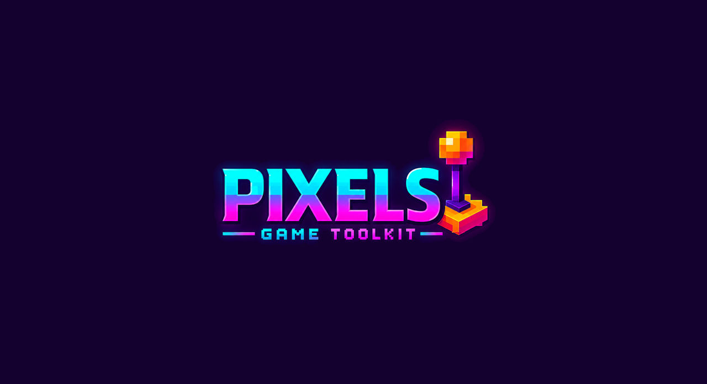
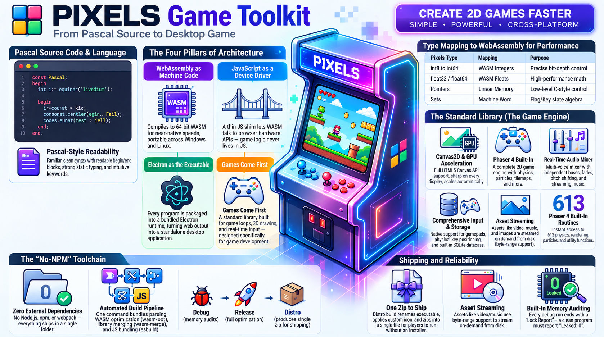

<div align="center">



[](https://discord.gg/Wb6z8Wam7p) [](https://bsky.app/profile/tinybiggames.com) [](https://www.facebook.com/groups/getpixels)

**Write Pascal-style code. Ship games to the desktop.**

</div>

## 🔥 What is PIXELS?

PIXELS is a general-purpose, game-first language: write Pascal-style code, get a desktop game or app. Games come first, so everything a game needs is built in, but nothing is games-only: tools, utilities and data apps are just as much at home. The compiler turns a Pascal/Oberon-inspired language into wasm64 and packages the result as an Electron desktop app for Windows (`win-x64`) or Linux (`linux-x64`). The Electron runtimes, the WebAssembly tools and the JavaScript bundler all ship inside the toolkit's `bin/` folder. No external toolchain, no Node install, no npm.

```pxl
module exe hello;

@exeicon "$P:res/assets/icons/pixels.ico";

begin
  println("Hello, I am %s! 🚀🔥✨", "PIXELS");
  
  var i: int32 = 0;
  var s: string = "PIXELS™ " + "Game Toolkit";
  
  println(s);
  
  for i := 1 to 10 do
    println("%d", i);
  end
end.
```

```
pixels hello -r
```

The compiler builds `hello.pxl` into `bin/res/electron/win-x64/resources/app.asar`, then launches the bundled Electron runtime. One command builds and runs your game. `-bm distro` turns it into one zip that IS the game.

### Four pillars

| Pillar | Principle |
|--------|-----------|
| 🎮 **Games come first** | The standard library is a game library: `app` (game loop, window, timers), `canvas2d` (2D drawing), `audio` (sound and music), `input` (keyboard/mouse/gamepad), `video` (playback), `localstorage` (save data), `sqlite3` (a real SQLite database), `dom` and `browser`, plus the vendor binding `phaser`. Game-first, not games-only: the same language builds tools, utilities and data apps. |
| ⚙️ **WebAssembly is the machine code** | wasm64 is the compile target -- portable, sandboxed, near-native speed. The same `output.wasm` runs on both targets. |
| 📜 **JavaScript is the device driver** | All platform access flows through thin JS shims. Every standard module is a `.pxl` + `.js` pair: the wasm module declares imports, the JS layer satisfies them. |
| 📦 **Electron is the executable** | Every `exe` build becomes an `app.asar` inside the bundled Electron runtime. `-bm distro` renames the Electron executable after your game and zips the whole app for shipping. |

## 🎬 Media

<div align="center">
<br/>




https://github.com/user-attachments/assets/62d6c1b3-fb99-4cbd-816d-8598c431c6b3


<!-- Drag intro.mp4 into a GitHub issue or PR comment, then paste the generated user-attachments URL here -->

</div>

## 🚫 What you do not install

| | |
|---|---|
| A WebAssembly toolchain | `wasm-opt` and `wasm-merge` (Binaryen) ship as standalone executables in `bin/res/wasm/`. |
| Node, npm, a bundler | `esbuild` ships beside them and bundles the JavaScript host layer. There is no `node_modules` to carry. |
| Electron | Both Electron 44.4.3 runtimes (`win-x64`, `linux-x64`) ship in `bin/res/electron/`. |
| An asar tool | The `app.asar` archive is written by the compiler's own asar writer, so Node's `asar` package is not needed. |
| Anything on the player's machine | The distro zip carries its own Electron runtime, so your game does not depend on the player's browser, and players install nothing. |

## 🎯 Who is PIXELS for?

- **Game developers** who want Pascal-style syntax, wasm64 performance, and a desktop build with no JavaScript tooling.
- **Delphi and Pascal developers** who want to make games with familiar syntax and ship them to Windows and Linux with nothing extra to install.
- **Anyone building a desktop app**: tools, utilities, editors and data apps. PIXELS is general-purpose: `dom` gives you menus and panels, and `sqlite3` and `localstorage` store your data.
- **Anyone who wants one file to hand out**: `-bm distro` packages the game and its Electron runtime into one `<name>-<target>.zip`.

## 🎮 A game loop

```pxl
module exe app_loop;

import
  canvas2d,
  app;

var
  x: float64;
  updates: int64;

routine Update(const dt: float64);
begin
  x := x + 120.0 * dt;
  if x > 800.0 then
    x := 0.0;
  end;

  updates := updates + 1;
  if updates = 600 then
    app.Quit();
  end;
end;

routine Render();
begin
  canvas2d.SetFillStyle("#000");
  canvas2d.FillRect(0.0, 0.0, 800.0, 600.0);
  canvas2d.SetFillStyle("#0f0");
  canvas2d.FillRect(x, 280.0, 40.0, 40.0);
end;

routine Shutdown();
begin
  println("shutdown handler");
end;

begin
  x := 0.0;
  updates := 0;
  canvas2d.Init(800, 600);
  println("setup done, loop running");
  app.Run(Update, Render, Shutdown);
end.
```

`app.Run` takes three routine references (any of them may be `nil`): `Update(dt)` is called at a fixed step (60 per second by default, see `app.SetTargetFPS`), and `Render()` once per display refresh (skipped while the window is hidden). When `app.Quit()` ends the program, the runtime calls your `Shutdown()` handler, then the `finalize` sections, then frees globals and (in debug builds) prints the leak report. (This is `bin/res/examples/app_loop.pxl`, trimmed.)

## ✨ The language

- **17 primitive types** (16 plus `varargs`) with exact wasm64 sizes: `int8` to `uint64`, `float32`, `float64`, `bool`, `char`, `wchar`, `ptr`, `varargs`, and managed, refcounted `string` (UTF-8) and `wstring` (UTF-16 length and comparison).
- **Variables and constants**: typed and untyped constants, constant folding.
- **Operators**: arithmetic, comparison, logical, bitwise, and compound assignment.
- **Control flow**: `if`/`else`, `while`, `for` (`to`/`downto`), `repeat`/`until`, `match` with ranges and lists, `break`, `continue`.
- **Exceptions**: `guard`/`except`/`finally`, `throw`, `throwcode`, `exccode`, `excmsg`, built on WebAssembly exception handling.
- **Routines**: one keyword for procedures and functions, `const`/`var` parameters, unconditional overloading, forward declarations, variadic arguments, first-class routine types.
- **Records**: plain, packed, aligned, derived, overlay, bitfield, and named record literals.
- **Choices, sets, arrays**: choices (named `int32` constants), sets, fixed arrays, dynamic arrays.
- **Memory**: typed and untyped pointers, `new`/`dispose`, `getmem`/`freemem`/`resizemem`, `setlength`. Strings and dynamic arrays are reference counted with deterministic cleanup; debug builds print a heap leak report at exit.
- **Modules**: `exe`, `lib`, `unit` with `import`, full qualification, `initialize`/`finalize`, and `public` declaration sections.
- **Conditional compilation**: `@define`, `@undef`, `@ifdef`, `@ifndef`, `@elseif`, `@else`, `@endif` with the predefined symbols `PIXELS`, `WASM64`, `BUILD_EXE`, `BUILD_LIB`.
- **Built-in testing**: `test` blocks after `end.` with eight assertion intrinsics, enabled by `@unittestmode on;`.
- **Game assets**: `@assets` maps a folder of files to keys that `canvas2d`, `audio` and `video` load on demand. Assets are never packed into `app.asar`: debug and release serve them in place from your source tree, distro ships them in `resources/__assets/`, and both stream with byte ranges so music and video can seek.
- **10 compiler intrinsics**: `len`, `size`, `format`, `utf8`, `cstr`, `wstr`, `paramcount`, `paramstr`, `exccode`, `excmsg`; `print` and `println` are statements.

## 📦 The standard library

Nine std modules and one vendor library ship with PIXELS. Import one, call its routines, and the build wires its JavaScript shim into your game for you.

| Library | Kind | Purpose | Public routines |
|---------|------|---------|-----------------|
| `app` | std | Application lifecycle: fixed-step game loop, quit/close, window, timers | 26 |
| `canvas2d` | std | 2D drawing: shapes, paths, gradients, text, images, transforms, pixels | 151 |
| `input` | std | Keyboard, mouse, and gamepad | 20 |
| `audio` | std | Sound effects and music | 29 |
| `video` | std | Video playback | 23 |
| `localstorage` | std | Persistent save data | 14 |
| `sqlite3` | std | SQLite database (Electron's built-in `node:sqlite`) | 33 |
| `browser` | std | Message box, open http(s) links in the player's default browser | 2 |
| `dom` | std | Page elements for menus and tools | 49 |
| `phaser` | vendor | Phaser 4.2.0 game framework | 613 |

Each std module is a `module unit` in `bin/res/libs/std/` backed by a JavaScript shim of the same name. Vendor libraries live one folder per library in `bin/res/libs/vendor/`.

## 🔗 Calling JavaScript

```pxl
module exe probe_extlibs;

@addlibrarypath "$P:res/tests/libs";

// JS external -- resolved from mathjs.js in libs/
routine JsAdd(const a: int32; const b: int32): int32;
  external "mathjs" name "JsAdd";

// Wasm external -- resolved from mathlib.wasm in libs/
routine Add(const a: int64; const b: int64): int64;
  external "mathlib" name "Add";

var
  r: int64;
begin
  println("JsAdd(2, 3) = %d", JsAdd(2, 3));
  r := Add(10, 20);
  println("Add(10, 20) = %d", r);
end.
```

The `external` clause declares a routine whose implementation lives outside the PIXELS module. The library name is the file name without extension and the wasm import module name; `name` is the import function name. Both are required.

There are two kinds of external library. A `.js` file becomes a wasm host import: it is bundled into `output.js` inside the app's `app.asar` and its functions are called through the import object passed to `WebAssembly.instantiateStreaming`. A `.wasm` file, such as the output of a PIXELS `lib` module, is merged into the program module by wasm-merge, so its exports become local functions in the final binary. Both resolve at build time, not at runtime.

## ⚙️ The pipeline

Every `.pxl` source file flows through the same stages:

```
.pxl source
  --> PIXELS.Lexer           (source text --> tokens)
  --> PIXELS.Parser          (tokens --> AST)
  --> PIXELS.Semantics       (type checking, name resolution)
  --> PIXELS.Emitter         (AST --> .wat, WebAssembly text format)
  --> wasm-opt               (.wat --> .wasm; -O0 in debug, -O3 in
                              release and distro)
  --> wasm-merge             (exe only, when PIXELS libs or foreign
                              .wasm externals are linked)
  --> esbuild                (runtime.js + every JS shim --> output.js;
                              minified in release and distro)
  --> PIXELS.Build           (main.js, preload.js, index.html,
                              package.json; PIXELS.Asar packs app.asar)
  --> Electron app           (bin/res/electron/<target>/resources/app.asar)
```

The wasm module is built with memory64, bulk-memory, nontrapping-float-to-int, exception-handling and multivalue, all enabled by default.

## 🎚️ Build modes and targets

Set the build mode with `-bm <mode>` or `@buildmode <mode>;`, and the target with `-t win-x64` (default) or `-t linux-x64`.

| Aspect | `debug` (default) | `release` | `distro` |
|---|---|---|---|
| wasm-opt flag | `-O0` | `-O3` | `-O3` |
| esbuild pass | runs, not minified | `--minify` | `--minify` |
| Electron menu bar | visible (default menu) | hidden | hidden |
| Leak report at exit | yes | no | no |
| Output | shared app in `bin/res/electron/<target>/` | shared app in `bin/res/electron/<target>/` | shared app plus `<outdir>/<name>-<target>.zip` |
| `-r` | runs the app | runs the app | ignored (warning `CMP002`) |

> [!IMPORTANT]
> **Only distro produces a file you can ship.** `debug` and `release` builds overwrite the one shared app in `bin/res/electron/<target>/resources/` every time, for every project. `distro` copies that app, renames `electron.exe` (or `electron` on Linux) after your module, applies the `@exeicon` icon on `win-x64`, and zips the result into the output folder.

## 🖥️ Command line

```
pixels <source> [OPTIONS]
```

| Flag | Description |
|---|---|
| `<source>` | PIXELS source file (`.pxl`); the extension is optional |
| `-r, --run` | Run the app in the bundled Electron runtime after building (ignored with a warning for `distro`) |
| `-o, --output <path>` | Set output directory (default: `output/` under the working directory) |
| `-bm, --buildmode <mode>` | Set build mode: `debug` (default), `release`, `distro` |
| `-t, --target <target>` | Set target platform: `win-x64` (default), `linux-x64` |
| `-h, --help` | Show help |

A `-bm` flag takes precedence over `@buildmode` in the source, and `-o` takes precedence over `@outputpath`. The exit code is `0` on success (or the app's own exit code when `-r` ran it), `1` when compilation failed, and `2` for a command-line error.

`pixels editor [files]` opens the PIXELS Editor (with the given files, if any) and returns at once.

## 🖊️ The PIXELS Editor

PIXELS ships its own editor beside the compiler: a desktop app built on Monaco (the editing surface inside VS Code), with nothing to install. Its smarts come from the compiler itself: it runs `pixels --lsp`, the compiler's own language server, so what the editor tells you is what the compiler will say.

- **Live diagnostics** as squiggles, line tints and a clickable Problems list
- **Completion**, snippets and signature help (intrinsics included)
- **Hover**, semantic highlighting, document highlights, folding and outline (`Ctrl+Shift+O`)
- **Go to definition** across modules (`F12`), find references (`Shift+F12`), rename (`F2`), workspace symbols (`Ctrl+T`), call hierarchy (`Shift+Alt+H`)
- **Format Document** (`Shift+Alt+F`): re-indents and normalises spacing from the compiler's own token stream, changes only the lines that need it, and refuses to touch a file that does not lex or balance
- **Build and run** with `F5`; build mode (`debug`/`release`/`distro`) and target (`win-x64`/`linux-x64`) are two dropdowns, and output streams live
- **Show Examples** puts the shipped examples in the explorer

The editor keeps its settings, open folders and tabs in its own `data\` folder, so the whole toolkit stays one self-contained folder.

## 📖 Documentation

| Document | Description |
|---|---|
| **[PIXELS Documentation](https://github.com/tinyBigGAMES/PIXELS/blob/main/docs/PIXELS.md)** | Getting started, the full language reference, module system, JavaScript interop, memory and data structures, formal grammar, standard library, runtime, diagnostics, code style, common tasks and the PIXELS Editor. |

## 🔨 Getting PIXELS

Grab the latest release from **[Releases](https://github.com/tinyBigGAMES/PIXELS/releases)**, extract it, and put `bin\` on your `PATH`. There is nothing else.

```
pixels hello -r
```

The source extension is optional: `pixels hello` and `pixels hello.pxl` are equivalent.

| | Requirement |
|---|---|
| **Host OS** | Windows x64 (the compiler runs here) |
| **Targets** | `win-x64` and `linux-x64` desktop apps on the bundled Electron 44.4.3 runtime |
| **Runtime dependencies** | None. The distro zip carries its own Electron runtime |
| **External toolchain** | None. `wasm-opt`, `esbuild`, and `wasm-merge` are bundled in `bin\res\wasm\` |

## 🔧 Building the compiler from source

For contributors who want to change the compiler itself.

| | Requirement |
|---|---|
| **Host OS** | Windows x64 |
| **Compiler** | Delphi (RAD Studio) |

**[Download ZIP](https://github.com/tinyBigGAMES/PIXELS/archive/refs/heads/main.zip)** or clone the repo:

```
git clone https://github.com/tinyBigGAMES/PIXELS.git
```

Open `projects\PIXELS.groupproj` in the Delphi IDE and build all projects, or run `bin\build-pixels.cmd`. This produces `pixels.exe` in `bin\`.

## 🤝 Contributing

- **Report bugs** with a minimal `.pxl` reproduction and the exact command used.
- **Suggest features**: describe the use case first, then the syntax you have in mind.
- **Submit pull requests** for bug fixes, documentation, new test cases and well-scoped features.
- **Review and discuss** open pull requests and issues.

Join the [Discord](https://discord.gg/Wb6z8Wam7p) to talk development, ask questions, or show what you are building.

## 💖 Support the project

If PIXELS saves you time, helps you learn, or sparks something useful:

- ⭐ **Star the repo**: it costs nothing and helps others find the project
- 📣 **Spread the word**: write a post, mention it in a community, or share a screenshot
- 💬 **Join the community**: show what you are building and help shape what comes next on [Discord](https://discord.gg/Wb6z8Wam7p)
- 🧪 **Try examples**: real usage finds issues that synthetic tests miss
- 💖 [**Become a sponsor**](https://github.com/sponsors/tinyBigGAMES): sponsorship directly funds development, examples, and documentation

## 📜 License

PIXELS is licensed under the **Apache License, Version 2.0**. See [LICENSE](https://github.com/tinyBigGAMES/PIXELS?tab=License-1-ov-file) for details.

Apache 2.0 is a permissive open source license that lets you use, modify, and distribute PIXELS freely in both open source and commercial projects. You are not required to release your own source code. Attribution is required: keep the copyright notice and license file in place.

## 🔗 Links

- 🌐 [Homepage](https://getpixels.org)
- 🧑‍💻 [GitHub](https://github.com/tinyBigGAMES/PIXELS)
- 🐞 [Issues](https://github.com/tinyBigGAMES/PIXELS/issues)
- 📖 [Documentation](https://github.com/tinyBigGAMES/PIXELS/blob/main/docs/PIXELS.md)
- 💬 [Discord](https://discord.gg/Wb6z8Wam7p)
- 🦋 [Bluesky](https://bsky.app/profile/tinybiggames.com)
- 👥 [Facebook Group](https://www.facebook.com/groups/getpixels)
- 🎮 [tinyBigGAMES](https://tinybiggames.com)

<div align="center">

**PIXELS**&#8482; Game Toolkit

Copyright &copy; 2026-present tinyBigGAMES&#8482; LLC<br/>All Rights Reserved.

</div>
